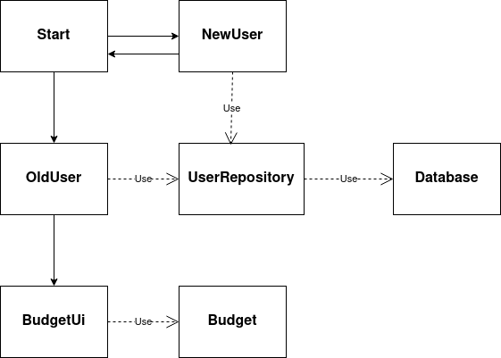
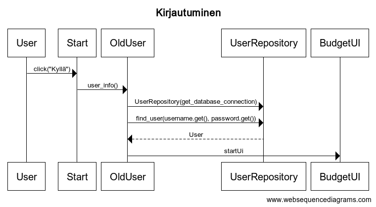

# Arkkitehtuurikuvaus

### Rakenne
Ohjelmassa on eriytetty käyttöliittymä ja itse koodi omiin moduuleihinsa. Käyttöliittymästä vastaa index.py, users_ui.py ja budget_ui.py. Lisäksi omissa moduuleissaan on, csv-tiedostojen hallinta sekä tietokantaan liittyvät moduulit. Show_budget-moduuli on edelleen eriyttämättä, sillä se on edelleen työn alla.

### Käyttöliittymä
Käyttöliittymä pyritään pitämään erillään muusta koodista. Tällä hetkellä erilaisia näkymiä ovat aloitusnäkymä, rekisteröityminen, kirjautuminen, budjetin luominen sekä budjetin näyttäminen tauluna. Tällä hetkellä nämä kaikki aukeavat omiin ikkunoihinsa.

### Sovelluslogiikka
Sovelluslogiikasta vastaa:
- Budget-luokka (uuden budjetin luominen )
- Expenses-luokka (uuden menon lisääminen csv-tiedostoon)
- BudgetList-luokka (hakee csv tiedostot, sekä näyttää tiedot taulukossa)
- CSV-files-luokka (kirjoittaa CSV-tiedostoon ja hakee sieltä tietoja)

### Luokkakaavio käyttöliittymä-luokkien ja sovelluslogiikka-luokkien suhteista.

### Tietojen pysyäistallennus
Rekisteröitymis- ja kirjautumistietojen tallennuksesta ja hakemisesta SQL-tietokannan taulusta Users, vastaa User-Repository-luokka. Tässä luokassa create_user(username, password) lisää uuden käyttäjän tietokantatauluun ja find_user(username, password) etsii vastaavaa käyttäjänimi-salasana-paria samasta tietokanta-taulusta.

Menojen kirjaamisesta CSV-tiedostoon sekä tietojen hausta tiedostosta, vastaa CSVfiles-luokka. Tässä luokassa write_to_file-funktio kirjaa tiedot CSV-tiedostoon ja luo samalla tiedoston jos tiedostoa ei vielä ole olemassa. Tiedosto luodaan käyttämällä valitun päivämäärän kuukautta ja vuotta, month_year_budget.csv. Funktio read_file hakee tiedot halutusta tiedostosta ja jos tiedostoa ei ole olemassa, funktio luo sen.

### Päätoiminnallisuudet

